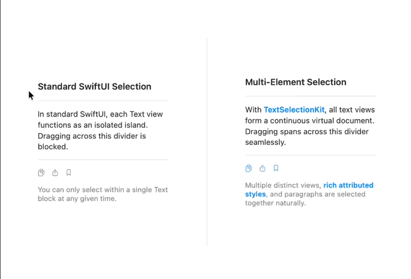

# TextSelectionKit

**Native, continuous multi-element text selection for SwiftUI.**

[](https://swift.org)
[](https://developer.apple.com)
[](LICENSE)

<p align="center">
  
</p>

---

## The Problem

In standard SwiftUI, applying `.textSelection(.enabled)` treats each `Text` view as an isolated selection region. Users cannot drag their mouse or finger to highlight text across multiple headings, paragraphs, dividers, or columns.

## The Solution

**TextSelectionKit** unifies discrete SwiftUI views into a continuous virtual document coordinate space. Dragging seamlessly spans headings, body paragraphs, and dividers with authentic platform-native text selection physics, selection handles, magnifying loupes, and contextual menus.

```swift
import SwiftUI
import TextSelectionKit

struct ArticleView: View {
    var body: some View {
        SelectionContainer {
            VStack(alignment: .leading, spacing: 12) {
                SelectableText("Introduction to TextSelectionKit")
                    .font(.title2.bold())

                Divider()

                SelectableText("Dragging the mouse or finger across this divider smoothly selects both the headline and this paragraph together.")
                    .font(.body)
            }
            .padding()
        }
    }
}
```

---

## Features

- 🎯 **Continuous Multi-Element Selection**: Drag across distinct text views, headings, paragraphs, and dividers.
- 🍏 **True Platform-Native Behavior**:
  - **macOS**: AppKit first responder coordination, `NSColor.selectedTextBackgroundColor`, keyboard arrow navigation, Shift-selection, and Quick Look dictionary lookups.
  - **iOS & visionOS**: UIKit `UITextInput` integration, native selection grab handles, magnifying loupe tracking, and `UIEditMenuInteraction`.
- ⚡ **Zero-Allocation CoreText Caching**: Backed by `CTFrame` and `CTLine` geometry caches with $O(\log N)$ binary search hit-testing during 60–120 FPS drag gestures.
- ✍️ **Complete Typography & Rich Text**: Supports Dynamic Type, all system font weights and designs (`.serif`, `.rounded`, `.monospaced`), letter tracking, kerning, underlines, strikethroughs, baseline offsets, and `+` concatenation.
- 🌍 **Right-to-Left (RTL) & Bi-Directional Scripts**: Accurate glyph run selection and caret mapping for Arabic, Hebrew, and mixed Latin scripts.
- 🗂️ **Multi-Column & Grid Reading Order**: Override 2D visual layout order with `.selectionOrder(_:)` for columnar flows.
- 🛡️ **Hit-Test Gesture Protection**: Choose between `.textOnly` (prevents gesture collisions with buttons/toggles) and `.container` (margin drag-selection for document readers).
- 📋 **Custom Context Menu DSL**: Build rich contextual menus using `SelectionButton`, `SelectionMenu`, and `SelectionDivider` with shortcut displays and placement modes.
- 🕹️ **Programmatic Selection**: Observe, inspect, and manipulate selection ranges, query selections by element ID, and copy rich text to the clipboard with `SelectionManager`.

---

## Requirements

- **iOS 17.0+** / **iPadOS 17.0+**
- **macOS 14.0+**
- **visionOS 1.0+**
- **Swift 6.0+** / **Xcode 16.0+**

---

## Installation

### Swift Package Manager

Add `TextSelectionKit` to your `Package.swift` dependencies:

```swift
dependencies: [
    .package(url: "https://github.com/rubengullatz/TextSelectionKit.git", from: "1.0.0")
]
```

Or in Xcode:
1. Select **File > Add Package Dependencies...**
2. Enter the repository URL: `https://github.com/rubengullatz/TextSelectionKit.git`
3. Select your version rules and click **Add Package**.

---

## Quick Start

### 1. Basic Multi-Element Selection

Wrap your layout in a `SelectionContainer` and replace `Text` views with `SelectableText`:

```swift
import SwiftUI
import TextSelectionKit

struct NoteView: View {
    var body: some View {
        SelectionContainer {
            VStack(alignment: .leading, spacing: 16) {
                SelectableText("Meeting Agenda")
                    .font(.headline)

                Divider()

                SelectableText("1. Review architecture milestones\n2. Discuss release timeline")
                    .font(.body)
            }
            .padding()
        }
    }
}
```

### 2. Multi-Column Reading Order

In side-by-side or grid layouts, use `.selectionOrder(_:)` to prioritize column-first traversal over default top-to-bottom row scanning:

```swift
SelectionContainer {
    HStack(alignment: .top, spacing: 20) {
        // Left Column (Selected 1st)
        VStack(alignment: .leading) {
            SelectableText("Column 1: Header")
            SelectableText("Column 1: Body")
        }
        .selectionOrder(0)

        // Right Column (Selected 2nd)
        VStack(alignment: .leading) {
            SelectableText("Column 2: Header")
            SelectableText("Column 2: Body")
        }
        .selectionOrder(1)
    }
}
```

### 3. Custom Delimiters & Disabled Sub-Hierarchies

```swift
VStack(alignment: .leading, spacing: 12) {
    // Delimiter for inline tokens (copies as "First Last" instead of newline)
    HStack {
        SelectableText("First")
        SelectableText("Last")
    }
    .selectionDelimiter(" ")

    // Exclude metadata/badges from participating in selection
    VStack {
        SelectableText("Unselectable Tag / Badge")
    }
    .selectableTextDisabled()
}
```

### 4. Custom Context Menus

Attach custom actions to the native edit menu on iOS and context menu on macOS:

```swift
SelectionContainer {
    ArticleContentView()
}
.selectionContextMenu(placement: .append) { context in
    SelectionButton(
        "Highlight",
        systemImage: "highlighter",
        shortcut: SelectionKeyboardShortcut("h", modifiers: [.command, .shift])
    ) {
        print("Highlighted: \(context.selectedText)")
    }

    SelectionButton("Quote in Reply", systemImage: "quote.opening") {
        print("Quoting: \(context.selectedText)")
    }

    SelectionDivider()

    SelectionMenu("Share Selection", systemImage: "square.and.arrow.up") {
        SelectionButton("To Notes", systemImage: "note.text") { }
        SelectionButton("To Messages", systemImage: "message") { }
    }
}
```

### 5. Programmatic Selection & HUD Controls

```swift
struct ControlledView: View {
    @State private var manager = SelectionManager()

    var body: some View {
        VStack {
            HStack {
                Button("Select All") { manager.selectAll() }
                Button("Copy") { manager.copySelection() }
                    .disabled(!manager.hasSelection)
                Button("Deselect") { manager.deselectAll() }
                    .disabled(!manager.hasSelection)
            }

            SelectionContainer(manager: manager) {
                VStack(alignment: .leading) {
                    SelectableText("Section A", id: "section-a")
                    SelectableText("Section B", id: "section-b")
                }
            }

            if manager.hasSelection {
                Text("Selected \(manager.selectedText.count) characters across elements: \(manager.selectedIDs(String.self).joined(separator: ", "))")
                    .font(.caption)
                    .foregroundStyle(.secondary)
            }
        }
    }
}
```

---

## Examples & Showcase App

The repository includes a showcase target (`Examples/TextSelectionKitExample`) featuring:
1. **Side-by-Side Comparison**: Standard SwiftUI selection vs. TextSelectionKit.
2. **Feature Showcase**: Live selection HUD, attributed formatting, and disabled sub-hierarchies.
3. **Typography & Font Modifiers**: Complete weight spectrum, designs, tracking, and concatenation.
4. **Complex & RTL Layouts**: Multi-column grids and Arabic/Hebrew script rendering.
5. **Long Document Reader**: Margin hit-testing and performance testing.

---

## License

This project is licensed under the MIT License. See the [LICENSE](LICENSE) file for details.
